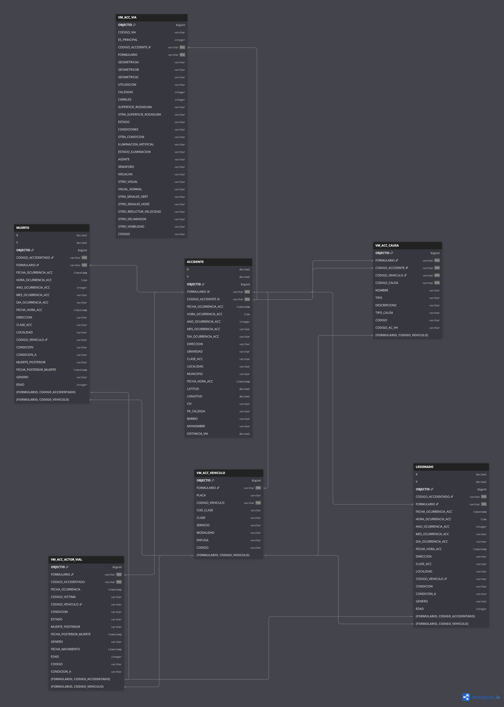

# PrediRuta

Proyecto aplicado de analítica de datos para analizar la siniestralidad vial en Bogotá y modelar la ocurrencia, el tipo y la severidad de los accidentes.

## Modelo relacional

El modelo original se depuró para conservar solo la información necesaria y evitar columnas repetidas. `ACCIDENTE_ID`, `VEHICULO_ID`, `ACTOR_ID`, `CAUSA_ID` y `CLIMA_ID` permiten relacionar las tablas mediante identificadores enteros.

El modelo final contiene:

- `ACCIDENTE`: fecha, coordenadas, clase y variable objetivo.
- `CLIMA`: observaciones meteorológicas horarias.
- `VIA`: condiciones de la vía asociada al accidente.
- `VEHICULO`: vehículos involucrados.
- `ACTOR_VIAL`: personas involucradas de forma anonimizada.
- `CAUSA`: causas registradas para el accidente.

| Modelo original | Modelo depurado de PrediRuta |
|-----------------| -----------------------------|
|  |  |

Los esquemas también están disponibles en formato [SQL](data/modelos_relacionales/modelo_relacional_prediruta.sql) y [DBML](data/modelos_relacionales/modelo_relacional_prediruta.txt).

## Obtención de los datos

### Siniestros viales

Los datos provienen del conjunto oficial [Siniestralidad BD](https://datos.movilidadbogota.gov.co/maps/ea243e7de8e846c8bd27e47c08771d66/about), publicado por la Secretaría Distrital de Movilidad de Bogotá. La información original incluye accidentes, vías, vehículos, actores viales, lesionados, fallecidos y causas.

Durante la limpieza se validaron las fechas, coordenadas y relaciones entre las tablas. También se conservaron únicamente los accidentes ubicados dentro del perímetro urbano de Bogotá y se retiraron datos sensibles o repetidos.

### Clima

El clima se obtuvo mediante [Open-Meteo](https://open-meteo.com/) y se relacionó con cada accidente según su ubicación y hora:

- Antes de 2017 se utilizó **ERA5**, con una resolución aproximada de 25–28 km.
- Desde 2017 se utilizó **ECMWF IFS**, con una resolución aproximada de 9 km.
- Cada accidente se asignó al punto meteorológico más cercano.
- La hora del accidente se aproximó a la observación horaria más cercana.
- Los accidentes que comparten punto y hora usan el mismo `CLIMA_ID`, evitando duplicar datos.

La tabla final incluye temperatura, humedad, sensación térmica, precipitación, lluvia, nubosidad, presión y velocidad y dirección del viento.

## Flujo general

```text
Datos originales → limpieza y validación → tablas relacionales → datasets de modelado → modelos predictivos
```

El notebook `data/construccion_dataset.ipynb` genera:

- `DATASET_OCURRENCIA.csv`: casos y controles por celda y hora.
- `DATASET_EVENTOS.csv`: accidentes ocurridos para estudiar tipo y severidad.
- `TABLA_COMPLETA_ACCIDENTES.csv`: información consolidada para análisis histórico.
- `DICCIONARIO_CATEGORIAS.csv`: referencia de las variables categóricas codificadas.
