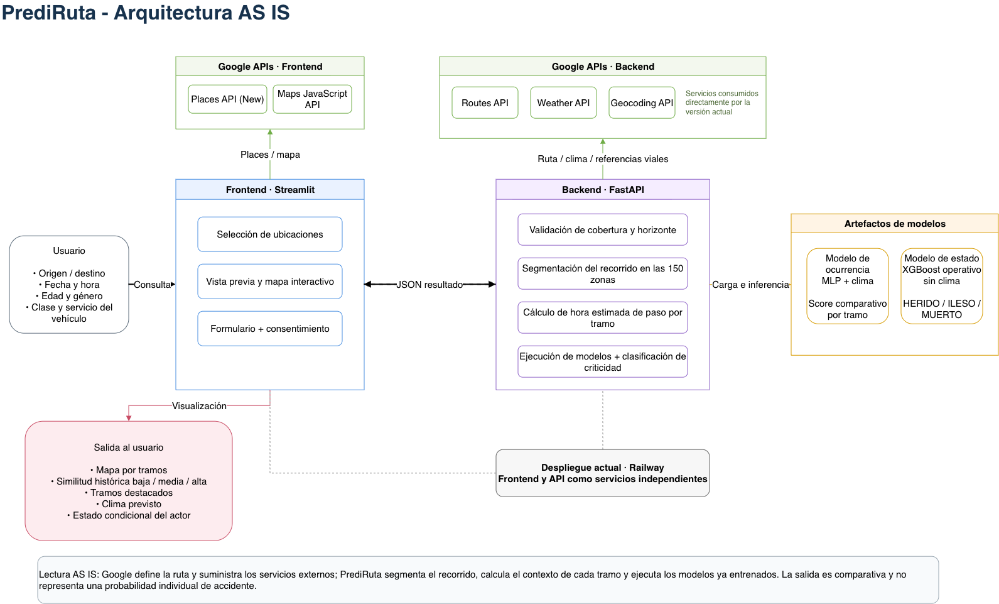
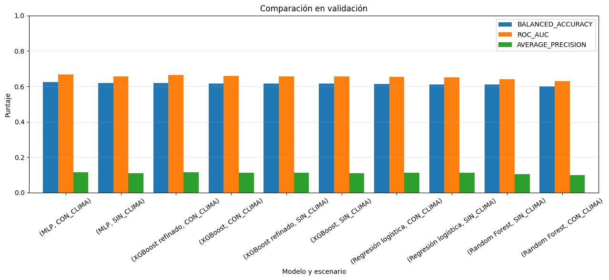
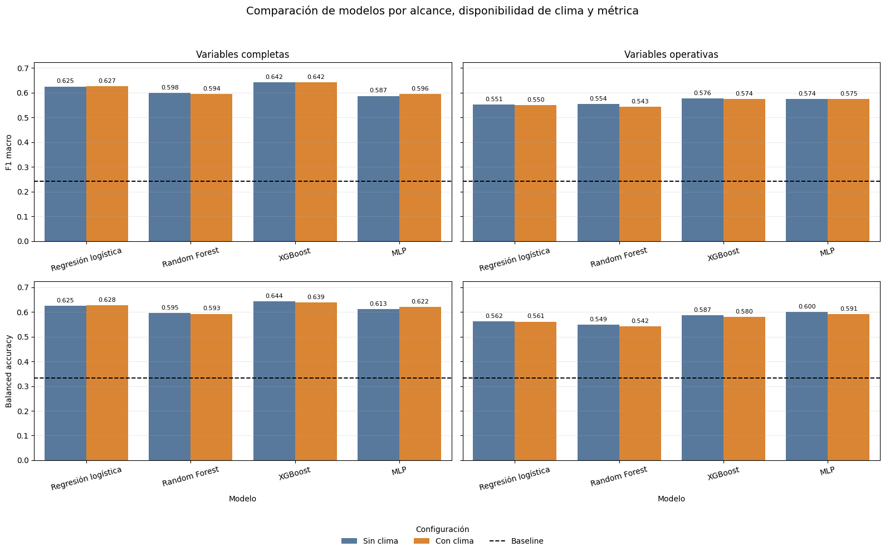

# PrediRuta

PrediRuta es un MVP final de analítica vial para Bogotá. Permite consultar un recorrido futuro y visualizar, por tramo, su coincidencia relativa con patrones históricos de siniestralidad, junto con la hora estimada de paso y el clima previsto.

La aplicación está disponible en [Railway](https://prediruta-front-main.up.railway.app).

## Qué entrega el MVP

El usuario indica origen, destino, fecha, hora y un perfil básico. PrediRuta obtiene la ruta con Google Routes, la segmenta sobre las 150 zonas utilizadas en el entrenamiento, consulta el pronóstico horario de Google Weather y evalúa cada tramo.

El resultado muestra:

- el mapa y el detalle completo del recorrido;
- la hora estimada de paso por tramo;
- condición meteorológica, temperatura y probabilidad de lluvia;
- un nivel de coincidencia histórica: Bajo, Medio o Alto;
- en los tramos prioritarios, el estado condicional más compatible del actor: `HERIDO`, `ILESO` o `MUERTO`.

El nivel de coincidencia permite comparar los tramos dentro de una misma ruta. No es una probabilidad individual de accidente, no modifica la ruta propuesta por Google y no emite recomendaciones de conducción.

## Arquitectura

```text
Usuario
  │
  ▼
Streamlit (formulario, mapa y resultados)
  │
  ▼
FastAPI (validación, segmentación, clima e inferencia)
  ├── Google Routes, Weather y Geocoding
  └── Artefactos analíticos exportados
        ├── MLP de ocurrencia con clima
        └── XGBoost de estado del actor sin clima
```

El frontend y la API se despliegan como servicios independientes. La API valida consentimiento, cobertura geográfica y horizonte de consulta antes de usar servicios externos o ejecutar los modelos. La información de perfil se procesa en memoria durante la consulta y no se almacena de forma persistente.



El diagrama muestra la distribución operativa del MVP. El modelo MLP de ocurrencia con clima calcula el score comparativo de cada tramo; el modelo XGBoost de estado se consulta únicamente en los tramos priorizados. FastAPI concentra la validación, la integración con servicios externos y la inferencia antes de devolver el resultado a Streamlit.

## Modelos incluidos

| Objetivo | Modelo integrado | Uso en el MVP | Resultado temporal principal |
| --- | --- | --- | --- |
| Ocurrencia | MLP con clima | Ordena la coincidencia histórica de cada tramo | Prueba 2024-2025: ROC-AUC 0,6308; balanced accuracy 0,5981; F1 0,1055 |
| Estado del actor | XGBoost operativo sin clima | Estimación condicional en tramos prioritarios | Prueba 2024-2026: F1 macro 0,5688; balanced accuracy 0,5926; ROC-AUC macro 0,8367 |
| Clase de accidente | No integrado | Se conserva como experimento | F1 macro 0,3735; se excluye por desempeño insuficiente |

El modelo de ocurrencia utiliza zona, mes, día de la semana, hora y variables meteorológicas. El modelo de estado incorpora edad, género, clase y servicio del vehículo, además de las variables operativas disponibles durante la consulta. Su salida se interpreta bajo el supuesto de que ocurriera un siniestro.

Las siguientes comparaciones documentan la selección de los modelos que llegaron al MVP:





## Datos y preparación

La base depurada conserva 895.346 accidentes y seis entidades relacionadas: `ACCIDENTE`, `ACTOR_VIAL`, `VEHICULO`, `VIA`, `CAUSA` y `CLIMA`.

El proceso construye tres datasets con unidades de análisis diferentes:

| Dataset | Unidad de análisis | Uso |
| --- | --- | --- |
| `DATASET_OCURRENCIA.csv` | Año, zona, mes, día de la semana y hora | Modelo temporal de ocurrencia |
| `DATASET_EVENTOS.csv` | Accidente | Análisis por evento y clase de accidente |
| `TABLA_COMPLETA_MODELADO.csv` | Actor o accidente sin actor | Modelo de estado y experimento de clase |

Para ocurrencia se generan 302.400 combinaciones por año completo (`150 × 12 × 7 × 24`). El dataset abarca 2007-2025 y contiene 5.745.600 filas. Un valor de cero indica que no se registró un accidente en la combinación anual; no equivale a ausencia de circulación ni a una exposición real al riesgo.

## Notebooks

La secuencia de reproducción es:

1. [`data/limpieza_estructuracion_bd.ipynb`](data/limpieza_estructuracion_bd.ipynb): depuración y modelo relacional.
2. [`data/construccion_dataset.ipynb`](data/construccion_dataset.ipynb): construcción de datasets analíticos.
3. [`modelo/modelo_ocurrencia_accidente.ipynb`](modelo/modelo_ocurrencia_accidente.ipynb): selección y evaluación temporal de ocurrencia.
4. [`modelo/modelo_estado_victima.ipynb`](modelo/modelo_estado_victima.ipynb): selección del modelo de estado del actor.
5. [`modelo/modelo_clase_accidente.ipynb`](modelo/modelo_clase_accidente.ipynb): experimento de clase de accidente.

Los notebooks usan una partición temporal para distinguir entrenamiento, validación y prueba. En ocurrencia los cortes son 2007-2020, 2021-2023 y 2024-2025. Los modelos de estado y clase conservan una prueba parcial de 2024-2026.

## Estructura

```text
Prediruta/
├── app/
│   ├── api/                 # FastAPI, servicios externos e inferencia
│   ├── front/               # Interfaz Streamlit y componentes de Google Maps
│   ├── modelo/              # Artefactos y metadatos requeridos en producción
│   ├── tests/               # Pruebas de API, servicios, segmentación e inferencia
│   ├── Dockerfile.api
│   └── Dockerfile.front
├── data/
│   ├── limpieza_estructuracion_bd.ipynb
│   ├── construccion_dataset.ipynb
│   └── data_procesada/      # Productos intermedios y datasets finales
├── modelo/                  # Notebooks de experimentación y artefactos de respaldo
├── notebooks/               # Prototipos y análisis exploratorios
└── entregas/                # Material académico del proyecto
```

## Ejecución local

Los detalles de variables de entorno, credenciales de Google y despliegue están en [`app/README.md`](app/README.md). Resumen:

```bash
cd app
cp .env.example .env
# Configura las credenciales de Google en .env

docker build -f Dockerfile.api -t prediruta-api .
docker run -d -p 8000:8000 --env-file .env --name api_local prediruta-api

docker build -f Dockerfile.front -t prediruta-front .
docker run -d -p 8501:8501 --env-file .env \
  -e API_URL=http://host.docker.internal:8000/predict \
  --name front_local prediruta-front
```

- Aplicación local: http://localhost:8501
- Documentación de la API: http://localhost:8000/docs

Para el flujo completo se requieren Routes API, Weather API, Geocoding API, Places API (New) y Maps JavaScript API.

## Validación funcional

La evaluación final documentó dos consultas web de una misma ruta en fechas distintas, con 20 tramos por consulta. Ambas completaron el flujo desde la interfaz y mostraron ruta, criticidad, hora y clima. También se verificaron 28 fechas válidas, dos rechazos fuera de rango, 10 casos de clasificación por score y prioridad, y 200 repeticiones consistentes para la regla de nivel y color.

Esta evidencia confirma el funcionamiento integrado en los escenarios evaluados. No representa una prueba de disponibilidad continua, una medición de reducción de accidentes ni una evaluación formal de comprensión con usuarios.
